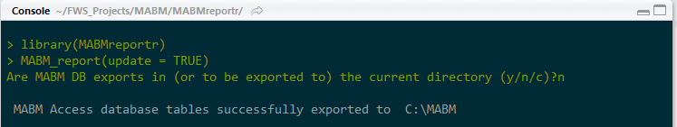

---
output:
  html_document:
  md_document:
    variant: markdown_github
---

[](https://travis-ci.org/adamdsmith/MABMreportr)

<!-- README.md is generated from README.Rmd. Please edit that file -->

```{r, echo = FALSE}
knitr::opts_chunk$set(
  collapse = TRUE,
  comment = "#>",
  fig.path = "README-",
  message = FALSE)

library(MABMreportr)
```

# USFWS Disclaimer
This United States Fish & Wildlife Service (USFWS) code is provided on an "as is" basis and the user assumes responsibility for its use.  USFWS has relinquished control of the information and no longer has responsibility to protect the integrity , confidentiality, or availability of the information.  Any reference to specific commercial products, processes, or services by service mark, trademark, manufacturer, or otherwise, does not constitute or imply their endorsement, recomendation or favoring by USFWS.  The USFWS seal and logo shall not be used in any manner to imply endorsement of any commercial product or activity by USFWS or the United States Government. 

# MABMreportr (Mobile Acoustical Bat Monitoring annual report generation)

This package contains functions for the creation of annual reports for stations participating in the USFWS Mobile Acoustical Bat Monitoring (MABM) program.

## Installing MABMreportr

The MABMreportr package require several programs to function properly (or at all):

1.  **[R](https://www.r-project.org/) (>= 3.2.5)**
2.  **[Rtools](https://cran.r-project.org/bin/windows/Rtools/)**
3.  **Full TeX installation**: Use the [basic MiKTeX installer](http://miktex.org/download) that matches your system architecture (e.g., 64-bit) on Windows, [MacTeX](https://tug.org/mactex/mactex-download.html) on Mac OS X, and [TeXLive](https://www.tug.org/texlive/doc/texlive-en/texlive-en.html#x1-140003) for Linux.  Notice that neither `MABMreportr`, nor the associated [`MABM` package](https://github.com/adamdsmith/MABM) has been tested outside of 64-bit Windows 7.
4.  **pandoc**: If you're using a relatively recent version of [RStudio](https://www.rstudio.com/products/rstudio/download/preview/), pandoc is included.  Using `MABMreportr` outside of RStudio will require a recent version of [pandoc](http://pandoc.org/installing.html) (>= 1.12.3).
5.  Microsoft Access

R, Rtools, RStudio, and Microsoft Access (and possibly the TeX installation) will require administrative priveleges but the installation of packages after this initial install will not.  It's likely Microsoft Access is already installed on your DOI computer.

You also need an up-to-date, local copy of the MABM database.  Currently, this applies to two people in the world, but it will be easy to provide a remotely accessible location for this database down the road.

With the installation formalities out of the way, it's simple to install and load the MABMreportr package to access its functionality.

```{r, eval = FALSE}
# If devtools package is not installed
install.packages("devtools", dependencies = TRUE)

# Now install and load MABMreportr
devtools::install_github("adamdsmith/MABMreportr")
library("MABMreportr")
```

## Using MABMreportr

We have only two functions with which to concern ourselves, `setup_MABM_reports` and `MABM_report`.  The arguments and options available in each function are detailed in their associated help files: `?setup_MABM_reports` or `?MABM_report`.

### Preparing to generate annual reports

`setup_MABM_reports` must be called prior to generating annual reports.  In short, this function calls a macro planted inside the MABM database to export the data necessary to create annual reports for MABM routes. It needs only to be run a single time after the data for a given survey year has been entered into the database.

If all goes according to plan, `setup_MABM_reports` will automagically find the Microsoft Access executable file (if not, it prompts you to do so manually) and prompt you to browse to the local copy of the MABM database.  Currently, the function exports the relevant data from the MABM database to a few *.csv files in the C:/temp directory (which is created if not present on your machine).  This obviously means that `setup_MABM_reports` will not, at present, play nice on Mac OS X and likely Linux machines.

To perform the setup, call the function with no listed arguments:

```{r setup, eval=FALSE}
setup_MABM_reports()
```

Assuming the function finds the Microsoft Access executable, you'll be prompted to locate the MABM database.

  

And, when all goes well, you'll be notified on the console.

  

If the data files exported from the MABM database already exist on your computer (e.g., because you're preparing to create annual reports for the newest year of surveys), you'll be prompted to confirm the overwrite of these files.

  

### Generating annual reports

Once `setup_MABM_reports` is successfully completed, we can start generating reports using the `MABM_report` function. By default, `MABM_report` will generate a report for the current calendar year (change with the `year` argument) for the one or more stations selected from the dialog box; select multiple stations by holding down the control/command button and clicking addition stations.

```{r make_reports, eval=FALSE}
MABM_report()
```

  

The progress of report generation is reported to the console.  Of course successful report generation requires that the MABM database contains data for a given station in the specified year.  If not, that station is skipped and a error message is returned.


By default, the reports are output to the current working directory.  Future versions of `MABM_reportr` will attempt to put the reports where they belong, in the directories associated with each station.  Stay tuned...


