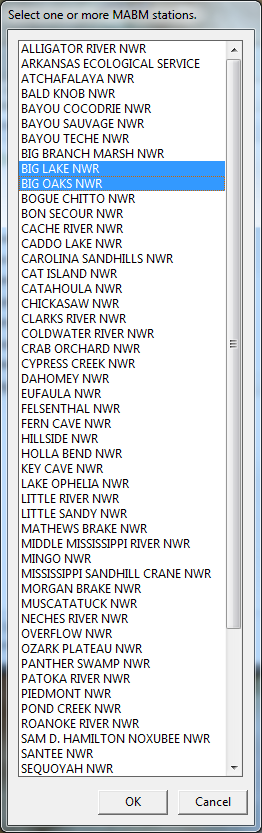

---
output:
  md_document:
    variant: markdown_github
---

[](https://travis-ci.org/adamdsmith/MABMreportr)

<!-- README.md is generated from README.Rmd. Please edit that file -->

```{r, echo = FALSE}
knitr::opts_chunk$set(
  collapse = TRUE,
  comment = "#>",
  fig.path = "README-",
  message = FALSE)

library(MABMreportr)
```

# USFWS Disclaimer
This United States Fish & Wildlife Service (USFWS) code is provided on an "as is" basis and the user assumes responsibility for its use.  USFWS has relinquished control of the information and no longer has responsibility to protect the integrity , confidentiality, or availability of the information.  Any reference to specific commercial products, processes, or services by service mark, trademark, manufacturer, or otherwise, does not constitute or imply their endorsement, recomendation or favoring by USFWS.  The USFWS seal and logo shall not be used in any manner to imply endorsement of any commercial product or activity by USFWS or the United States Government. 

# MABMreportr (Mobile Acoustical Bat Monitoring annual report generation)

This package contains functions for the creation of annual reports for stations participating in the USFWS Mobile Acoustical Bat Monitoring (MABM) program.

## Installing MABMreportr

The MABMreportr package require several programs to function properly (or at all):

1.  **[R](https://www.r-project.org/) (>= 3.2.5)**
2.  **[Rtools](https://cran.r-project.org/bin/windows/Rtools/)**
3.  **LaTeX distribution**: If you don't know what this means, we recommend you use `tinytex`. Install `tinytex` in R using the following command and following the onscreen prompts: `install.packages("tinytex"); tinytex::install_tinytex()`. Other LaTeX distribution options include [MiKTeX](http://miktex.org/download) for Windows, [MacTeX](https://tug.org/mactex/mactex-download.html) for Mac OS X, and [TeXLive](https://www.tug.org/texlive/doc/texlive-en/texlive-en.html#x1-140003) for Linux.  Notice that neither `MABMreportr`, nor the associated [`MABM` package](https://github.com/adamdsmith/MABM) has been tested outside of 64-bit Windows 7.
4.  **pandoc**: If you're using a relatively recent version of [RStudio](https://www.rstudio.com/products/rstudio/download/preview/), pandoc is included.  Using `MABMreportr` outside of RStudio will require a recent version of [pandoc](http://pandoc.org/installing.html) (>= 1.12.3).
5.  **Microsoft Access**
6.  **[PDFtk Server](https://www.pdflabs.com/tools/pdftk-server/)** 

R, Rtools, RStudio, Microsoft Access, and PDFtk Server will require administrative priveleges but the installation of packages after this initial install will not.  It's likely Microsoft Access is already installed on your DOI computer.  `MABMreportr` is tested only on PCs running Microsoft Windows.

You also need an up-to-date, local copy of the MABM database.  Currently, this applies to two people in the world, but it will be easy to provide a remotely accessible location for this database down the road.

With the installation formalities out of the way, install and load the MABMreportr package to access its functionality.

```{r, eval = FALSE}
# If devtools package is not installed
install.packages("devtools", dependencies = TRUE)

# Now install and load MABMreportr
devtools::install_github("adamdsmith/MABMreportr")
library("MABMreportr")
```

## Using MABMreportr

We have only a single function with which to concern ourselves, `MABM_report`.  The arguments and options available for this function are detailed in its associated help file: `?MABM_report`.

### Preparing to generate annual reports

Prior to the first attempt to generate annual reports (or after the MABM database has been updated with a new season of data), several data tables must be exported from the MABM database.  This is accomplished by calling `MABM_report` using the `update = TRUE` argument (default is `FALSE`). In short, this function calls a macro planted inside the MABM database to export the data necessary to create annual reports for MABM routes. It needs only to be run a single time after the data for a given survey year has been entered into the database.

```{r, eval = FALSE}
MABM_report(update = TRUE)
```

You will then be prompted, in the console, to indicate if the current working directory either (1) contains MABM database exports (if you're not updating) or (2) is where you would like to place the exports (if this is the first run or an update).  In the example below, we indicate with 'n' or 'N' that it is not the directory where we wish to place database exports.  Had it been the correct directory, valid responses are 'y' or 'Y'.  'c' or 'C' cancels the function.

  

Since we indicated 'no', we are then prompted to browse to the directory where we will place MABM database exports.


If all goes according to plan, the Microsoft Access executable file will be found automagically (if not, it prompts you to do so manually) and then you'll be prompted to browse to the local copy of the MABM database.  


With the MABM database identified, the macro within is called and relevant data from the MABM database exported to a few *.xlsx files in the directory you specified previously.  Note that this exporting scheme has not been tested, and probably fails spectacularly, on Mac OS X or Linux machines.

You'll be notified on the console of the success or failure of this process.

  

If the data files exported from the MABM database already exist on your computer (e.g., because you're replacing last year's database exports with those from the newest year of surveys), you'll be prompted to confirm the overwrite of these files.

  

### Generating annual reports

The function then moves on to generating reports. By default, `MABM_report` will generate a report for the current calendar year (you can make historic reports by changing the `year` argument) for the one or more stations selected from the dialog box; select multiple stations by holding down the control/command button and clicking addition stations.

  

The progress of report generation is reported to the console.  Of course successful report generation requires that the MABM database contains data for a given station in the specified year.  If not, that station is skipped and an message indicating this fact is returned.


By default (`distribute = TRUE`), the function looks for a particular file hierarchy in the directory specified to house the MABM database exports. Specifically, it attempts to place the output report in an 'Annual Report' directory within the base/home directory for each MABM station, if it can be located. Again, to work properly, this requires a specific directory hierarchy. Please see the Details section of `?MABM_report` for more information and an example hierarchy. If `distribute = TRUE` but the base/home directory is not located, or if `distribute = FALSE`, the output report is placed in a generic 'Annual Reports' directory alongside the MABM database exports.

Likewise, by default (`interactive = TRUE`), the function generates an interactive `leaflet` map of georeferenced bat detections for each survey that occurred along each route associated with that station in the requested year. If the PDFtk Server program is found on your machine, these `html` files will be attached to the final report `pdf` and can be accessed via the "Attachments" tab in Adobe Reader. Double-clicking will open the interactive map in your default browser; the files are self-contained and can be accessed off-line.  If PDFtk is not found, the files are retained as self-contained `html` files next to the final report `pdf`.
